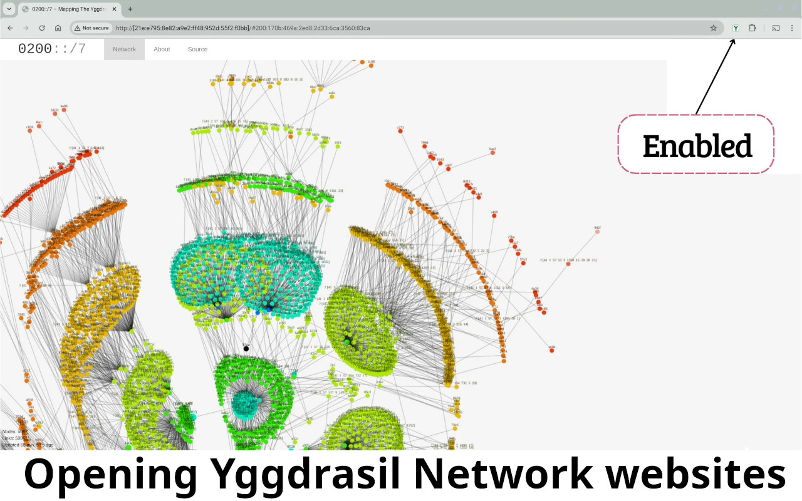

# Yggdrasil Network ChromeOS/Linux setup

> This package provides a Chrome extension and a setup script designed to enable ChromeOS users to access the [Yggdrasil Network](https://yggdrasil-network.github.io/) ([`0200::/7`](https://yggdrasil-network.github.io/2018/07/28/addressing.html)). Also works on Debian/Ubuntu.



Here's how this works:

1. 𝗬𝗴𝗴𝘀𝘁𝗮𝗰𝗸 𝗜𝗻𝘀𝘁𝗮𝗹𝗹𝗮𝘁𝗶𝗼𝗻:
   - The accompanying GitHub script installs [Yggstack](https://github.com/yggdrasil-network/yggstack) in the Linux on your ChromeOS device. It is configured to automatically start as a systemd service, ensuring it runs in the background without user intervention.
   -  Yggstack acts as a local proxy server set to listen on localhost port 1080 and will connect to the Yggdrasil Network through [ygg.thingylabs.io](https://ygg.thingylabs.io/).
   -  Sidenote: In contrast to the regular Yggdrasil client the official Yggstack will not exposed your Linux to the network.
2. 𝗖𝗵𝗿𝗼𝗺𝗲 𝗘𝘅𝘁𝗲𝗻𝘀𝗶𝗼𝗻:
   - The extension modifies Chrome's network settings to direct internet traffic from addresses within the Yggdrasil network range (0200::/7) through the Yggstack proxy.
   - A toggle icon in the browser toolbar provides a user interface to activate or deactivate the proxy functionality of the extension.

## Install

> ***Note:** On Linux you should be able to take the technically simpler route and just install [YggStack](https://github.com/yggdrasil-network/yggstack).*

1. **Install Chrome extension**:
   - **Via Chrome Web Store:**\
     Install the extension directly from the Chrome Web Store by following this link: [Chrome Web Store](https://chromewebstore.google.com/detail/yggdrasil-on-chromeos/hcgljgobhoaeojnhikfmnhdpmgbmflec).
   - **Or via manual installation:**\
     Download the repository from GitHub and load the extension (subfolder `chrome-extension/`) "unpacked" in your Chrome browser.
2. **Run setup script:**\
   Open a terminal and execute:
   ```
   bash -c "$(curl -fsSL https://raw.githubusercontent.com/perguth/yggdrasil-chromeos/master/setup.sh)"
   ```

## Usage
- Linux needs to be active on your ChromeOS for the proxy to work.
- Use the extension icon to control your access to the network.
- Start exploring the Yggdrasil Network through services like ⚡ [ygg-only.thingylabs.io](https://ygg-only.thingylabs.io/).

This setup offers a simple way for ChromeOS users to access and navigate the decentralized, secure Yggdrasil Network with minimal configuration.
